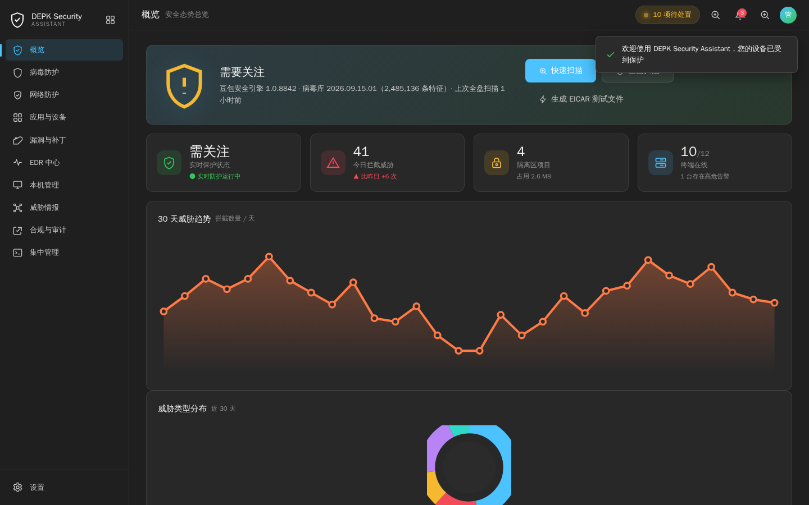
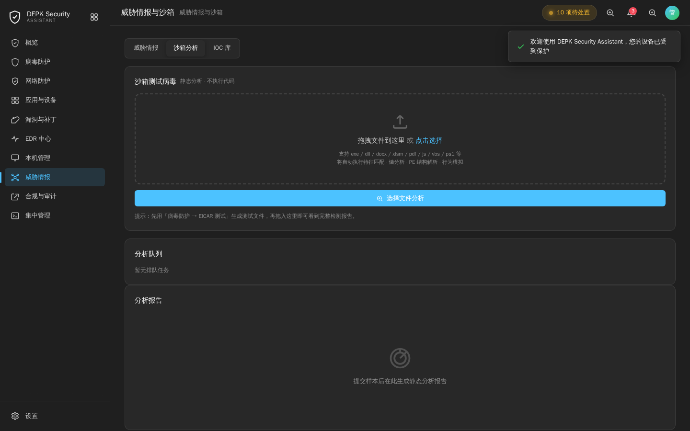
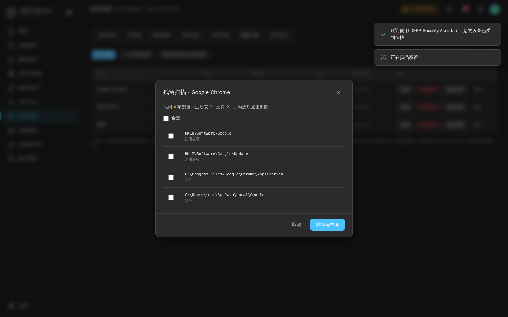

# DEPK Security Assistant 终端安全助手

> 面向个人与组织的 Windows 终端安全助手 · Win11 Fluent 深色 UI · **永久免费**（MIT 开源协议）
> 本地检测引擎真实可用，无需云端即可完成扫描、隔离、沙盒与系统管理。



## 为什么永久免费

本项目以 **MIT 许可证** 开源。任何人可以永久免费使用、复制、修改与分发，包含个人与商业用途，无任何付费墙、无功能阉割、无授权到期。未来版本同样遵循本许可。

## 功能总览

### 核心防护
- **真实本机扫描**：递归读取真实文件，SHA-256 指纹、熵值分析、PE/脚本/宏/勒索/挖矿特征检测，命中自动隔离
- **动态沙盒**：受限环境真实运行样本 5–15 秒，采集进程树 / 网络外联 / 文件写入行为，超时强杀并清理
- **静态沙箱分析**：PE 结构、导入表、可疑字符串、熵值、多引擎特征打分
- **加密隔离区**：威胁文件移入隔离目录并记录元数据，支持恢复 / 删除 / 清空
- **实时文件监控**：fs.watch 实时监控下载 / 桌面 / 文档目录，文件变更即时记录上报

### 本机管理（真实系统数据）
- 进程管理（列出 / 终止）、启动项、网络连接、系统信息
- U 盘识别、软件清单、**Geek 风格卸载工具**（卸载 / 强制删除 / 残留扫描清理 / 定位目录）
- 实时监控日志

### 集中管理控制台（界面）
统一策略下发、跨终端管理、资产清点、仪表盘、报表导出（CSV/JSON）

### 防护矩阵（策略界面）
病毒 / 恶意软件 / 勒索 / 无文件 / 内存 / 漏洞利用防护、AI/机器学习检测、行为分析、云查杀、定时 / 手动 / 离线 / U 盘扫描、Web 威胁防护、URL/DNS 过滤、邮件防护、反钓鱼 / 反垃圾邮件、网络/主机入侵防御、防火墙管理、应用 / 设备 / 外设 / 打印 / 截屏管控、数据防泄漏、敏感数据识别、数据分类分级、加密管理

### 漏洞与补丁
漏洞扫描、补丁管理、软件更新管理、安全基线检查、配置合规

### EDR / XDR / 威胁
EDR 端点检测与响应、XDR 扩展检测、MDR 托管检测、威胁狩猎、沙箱分析、威胁情报、攻击链还原、事件时间线、根因分析、自动遏制、终端隔离、进程终止、文件隔离、隔离区管理、攻击回滚、脚本控制、PowerShell 防护、宏病毒防护、浏览器保护、身份威胁检测

### 合规与审计
等保合规、日志 / 操作 / 管理员审计、告警通知、报表生成、SIEM/SOAR 集成、Syslog 转发、REST API、AD/LDAP、SSO、多因素认证、角色权限、多租户 / 分级 / 组策略管理

### 附加能力（界面）
MITRE ATT&CK 映射、遥测数据、取证调查、仪表盘、策略模板、白名单 / 黑名单、排除项管理、计划任务、终端定位、硬件变更监控、网络准入控制、应用白名单、驱动加载控制、内核篡改防护、防卸载、APT / 僵尸网络 / 挖矿 / 间谍 / Rootkit / 引导区病毒防护、勒索解密、备份 / 文件版本 / 快照 / 系统恢复、事件响应、用户行为分析、横向移动检测、凭证窃取防护、暴力破解检测、异常登录检测、C2 通信阻断、恶意 IP 阻断、端口 / 协议控制

## 安装

**方式一：安装向导（推荐）**
下载 `DEPKSecurityAssistant-Setup-*.exe`，双击运行：
- Win11 Fluent 风格安装向导，功能介绍 + 底部进度条
- 默认勾选「开机抢先启动」：登录时以高优先级（Priority 4）零延迟启动，早于绝大多数自启动程序，计划任务 + Run 键双保险
- 安装后自动创建桌面 / 开始菜单快捷方式，控制面板可随时卸载（保留隔离区数据）

**方式二：便携绿色版**
解压 `DEPKSecurityAssistant-win32-x64`，直接运行 `DEPKSecurityAssistant.exe` 即可，免安装。

> 未签名评估版：首次运行 SmartScreen 提示时点「更多信息 → 仍要运行」。

## 从源码构建

```bash
cd electron
npm install
npm start            # 开发运行
npx electron-packager . --platform=win32 --arch=x64 --out=dist --overwrite --asar
node inject.js "dist/DEPKSecurityAssistant-win32-x64/DEPKSecurityAssistant.exe" build/icon.ico
```

> Linux 无 Wine 环境打包提示：打包前请从 `package.json` 移除 `productName / version / author / license` 字段（electron-packager 在 Linux 上会因这些字段触发 Wine 依赖），产物名取自 `name` 字段。

## 技术说明

- 前端：单文件 HTML + 原生 JS（Win11 Fluent 深色 UI，11 个导航模块）
- 壳层：Electron（contextIsolation 开启）
- 本地引擎：`engine-shared.js`（SHA-256 / 熵值 / PE / 脚本 / 宏 / 勒索 / 挖矿特征）
- 系统能力：PowerShell CIM / 注册表 / fs.watch / 动态沙盒（PowerShell 受限运行）
- PE 签名信息注入：`inject.js`（resedit + pe-library，Linux 无 Wine 环境可用的图标 / 版本注入方案）

### 诚实说明
云查杀、威胁情报源、跨终端策略下发等**依赖服务端的能力**在本仓库中以界面演示形式呈现（已在界面标注）；**本地引擎、扫描、隔离、沙盒、本机管理、卸载工具均为真实功能**，不依赖网络即可工作。

## 测试

- 内置 EICAR 测试文件（`X5O!P%@AP[4\PZX54(P^)7CC)7}$EICAR-STANDARD-ANTIVIRUS-TEST-FILE!$H+H*`）可验证扫描与隔离流程
- 动态沙盒可对任意 `.exe` 样本运行行为采集

## 开源协议

[MIT](LICENSE) © 2026 DEPK Security



